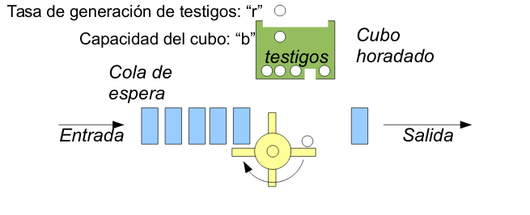

# Tema 2: Mecanismos y arquitecturas de red para la provisión de QoS

### 2.1. Problemas de la actual arquitectura best-effort

La filosofia de IP es que debe ser simple y tener la capacidad de entregar los paquetes de un origen a un destino si extiste un camino entre ellos.

Inicialmente la red no tenía los mecanismos necesarios (TCP) para garantizar la entrega de estos. Solo es necesario que lo implementen entre los extremos.

Otro dato era que el encaminamiento del camino más corto. Ahora se va a intentar arreglar evaluando valores de la red.

Estas deficiencias se pueden resumir en:
- Los encaminadores no pueden predecir la congestion
- No ofrece distinto tratamiento a distintas clases de tráfico
- No es capaz de admitir peticiones dinámicas
- Tiene una capacidad limitada para monitorizar el uso de los recursos de red.

Esto no se puede reparar solo con añadir un trato diferenciado a los distintos tipos de tráfico. Se deben abordar otras tareas:
- **Señalización** para solicitar extremo a extremo una QoS determinada.
- **Contabilidad** del uso de los recursos de red.

### 2.2. Mecanismos de provisión de QoS

La calidad de servicio observada de extremo a extremo es gracias a la QoS ofrecida por cada salto en la ruta. Para poder realizarlo, es necesario satisfacer los siguientes requisitos:

- **QoS por salto**. Mínimo elemento controlable para ofrecer QoS.
- **Ingeniería de tráfico y encaminamiento**. Utilizando caminos alternativos para no saturar la red, aunque haya que utilizar un camino más largo o con mayor retardo, etc.
- **Señalización**. Protocolos para definir y establecer la QoS. En principio TCP o UDP, pero también cabe la posibilidad de utilizar un middleware y utilizar otros protocolos.

#### 2.3.1. Procesamiento de paquetes por salto en un encaminador genérico (sin QoS)

Utilizando distintas interfaces de entrada y salida, una máquina de reenvío (dependiendo de la dirección IP, va a una interfaz u otra) y una máquina de gestión, encargada de controlar la congestión además de construir su base de información de envío.

#### 2.3.2. Procesamiendo de paquetes por salto en un encaminador con CQS

- **CQS**. Clasificador, encolado y planificador

Luego distintas fases de clasificación y consulta de la identidad del paquete y su destino, verificación de conformidad y marcado y el encolado y planificación (reenvío de paquete según las reflas de compartición de enlace o de conformado de tráfico, además de poder descartarlo en caso de congestión).

#### 2.3.3. Elementos para la provisión de QoS

- **Clasificador**, que identifica a que clase pertenece cada paquete.
- **Colas por clase de tráfico**, pudiendo definir el orden de cada uno.
- **Conformación de tráfico (traffic shaping)**. Se prefice el servicio que se le dará a un flujo, limitando el máximo ancho de banda que ese tráfico consumirá.
- **Verificación de conformidad (policing)**. Se definen diferente cuotas de entrada o de salida, y si se sobrepasa se rechazan.

#### 2.3.3.1. Clasificación de paquetes

- Lo más sencillo es utilizar *n* bits de la cabecera, siendo ese campo la clave de clasificación
- Las claves se comparan con unas reglas de clasificación para que el encaminador los dirija.
- Otra posibilidad es el uso de clasificación multicampo, definiendo los campos IP src, dst, el tipo de protocolo...

##### Claves de clasificación

La **clasificación multicampo** permite llevar a cabo la clasificación por flujos de aplicaciones. 
- En IPv4 las dir IP se encuentran en una posición fija de la cabecera, pero los puertos pueden aparecer en posiciones distintas, dependiendo del tamaño de la cabecera. 
- En IPv6 los puertos y el protocolo pueden aparecer en distintas posiciones debido a las cabeceras dinámicas que utiliza. Para aliviar este problema, se introduce el campo **etiqueta de flujo** de 20 bits.
- En el campo DSCP se pueden definir reglas de clasificación estrictas o definir rangos.

En resumen, para clasificar, se mira la clave de clasificación. Y en algunos casos hay que mirar más claves (multicampo). Además en algunos protocolos se facilita la clasificación de estos.

*Nota:* RFC (Request for Comment)-> Conjunto de documentos para la formalización del uso de protocolos o cualquier cosa de red. IETF se encarga de desarrollar y aprobar estos RFC.

#### 2.3.5. Conformación de tráfico

El mecanismo más extendido utilizado para regular la tasa con la que se permite a un flujo imyectar paquetes en la red es el leaky bucket.

